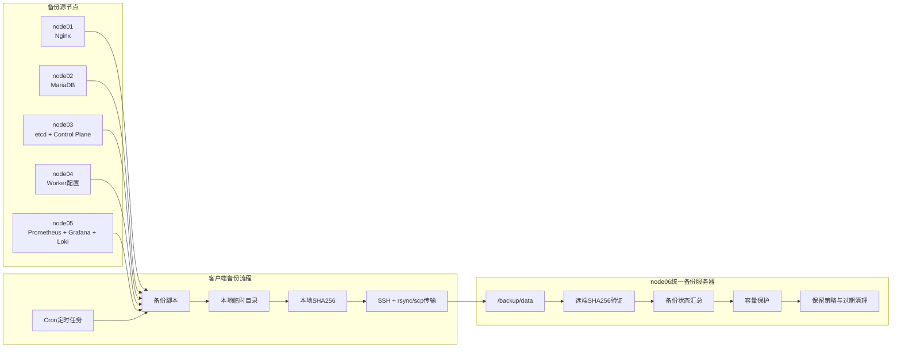
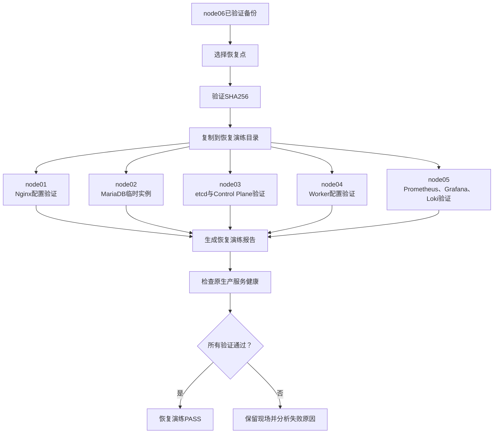

# 统一备份与隔离恢复流程

## 备份对象

| 节点 | 备份内容 |
|---|---|
| node01 | Nginx配置和站点文件 |
| node02 | MariaDB数据库逻辑备份 |
| node03 | etcd快照、Control Plane配置和集群元数据 |
| node04 | Kubernetes Worker配置 |
| node05 | Prometheus、Grafana、Loki配置与数据 |
| node06 | 统一保存所有节点的远端备份 |

## 备份数据流



## 单次备份执行过程

```text
Cron触发
  ↓
检查依赖、服务和源文件
  ↓
生成备份文件或快照
  ↓
生成本地SHA256
  ↓
通过专用SSH密钥传输到node06
  ↓
node06生成或验证远端SHA256
  ↓
写入备份日志和状态汇总
  ↓
执行容量保护与保留策略
```

## 隔离恢复流程



## 隔离原则

- 不直接覆盖生产配置。
- 不直接恢复到生产数据目录。
- MariaDB使用独立临时实例和独立Socket。
- etcd优先进行快照状态和恢复目录验证。
- Prometheus使用TSDB分析工具验证数据块。
- Grafana验证数据库文件及配置。
- Loki根据当前版本支持的校验方式验证配置和数据目录。
- 演练结束后确认原服务仍然正常运行。

## 数据完整性保护

备份同时保留：

```text
备份文件
SHA256校验文件
执行日志
远端校验结果
恢复演练报告
```

只有备份生成、传输、校验和恢复验证全部通过，才能认为备份链路有效。

## node06维护职责

```text
统一目录规范
    ↓
备份状态扫描
    ↓
容量阈值检查
    ↓
保留周期判断
    ↓
过期文件清理
    ↓
输出汇总报告
```

node06只负责集中保存和维护备份，不直接承载node01～node05的生产服务。
