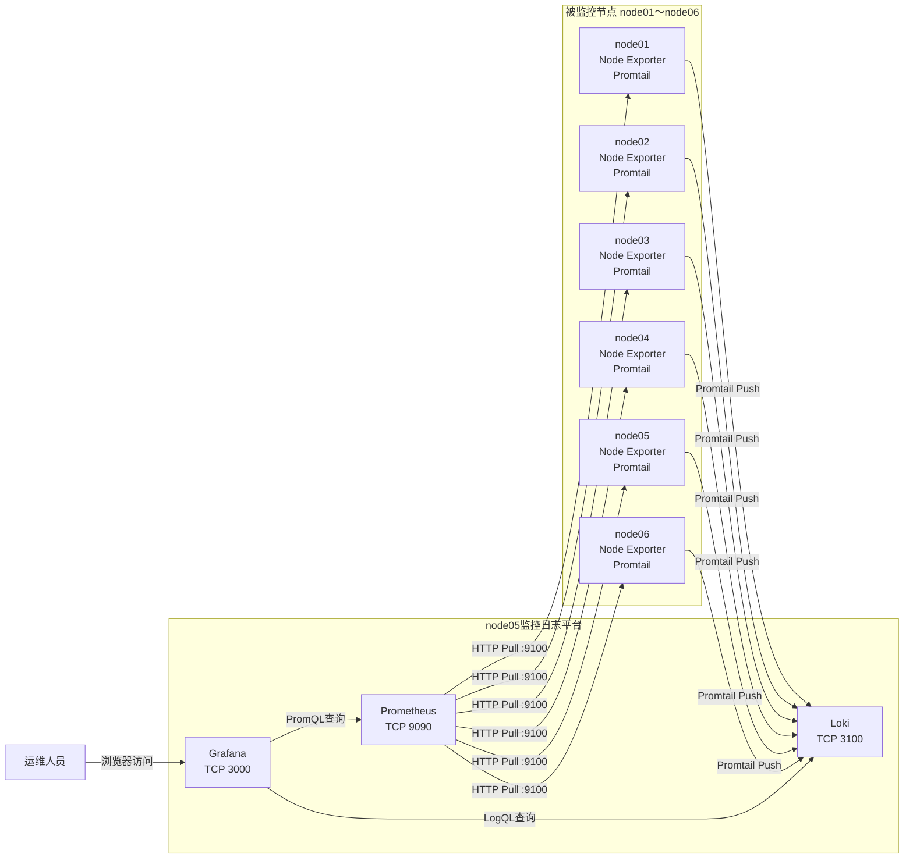

# 监控与日志数据流

## 组件职责

| 组件 | 部署位置 | 工作方式 |
|---|---|---|
| Node Exporter | node01～node06 | 暴露Linux主机指标 |
| Prometheus | node05 | 主动抓取Node Exporter和自身指标 |
| Promtail | node01～node06 | 读取本地日志并推送到Loki |
| Loki | node05 | 接收、索引和保存日志 |
| Grafana | node05 | 查询Prometheus和Loki并统一展示 |

## 数据流图



## 指标链路

```text
Node Exporter
    ↓ 暴露 /metrics
Prometheus主动抓取
    ↓ 保存到TSDB
Grafana通过PromQL查询
    ↓
仪表盘展示
```

Prometheus使用Pull模式，主动连接各节点的Node Exporter，而不是由Node Exporter主动推送指标。

## 日志链路

```text
应用和系统日志
    ↓
Promtail读取本地日志
    ↓ HTTP Push
Loki接收并存储
    ↓ LogQL
Grafana查询与展示
```

## 主要健康检查

Prometheus：

```bash
curl -fsS http://127.0.0.1:9090/-/ready
```

Grafana：

```bash
curl -fsS http://127.0.0.1:3000/api/health
```

Loki：

```bash
curl -fsS http://127.0.0.1:3100/ready
```

Promtail节点到Loki：

```bash
curl -fsS http://192.168.11.15:3100/ready
```

## 故障隔离思路

| 故障表现 | 优先检查 |
|---|---|
| 主机指标缺失 | Node Exporter、9100端口、Prometheus Target |
| Grafana无指标 | Prometheus健康状态、Grafana数据源 |
| 日志无法上传 | Promtail日志、网络、Loki 3100端口 |
| Loki返回500 | Loki实例健康状态、存储目录和Ring状态 |
| Grafana日志为空 | Loki数据源、LogQL查询和Promtail标签 |
