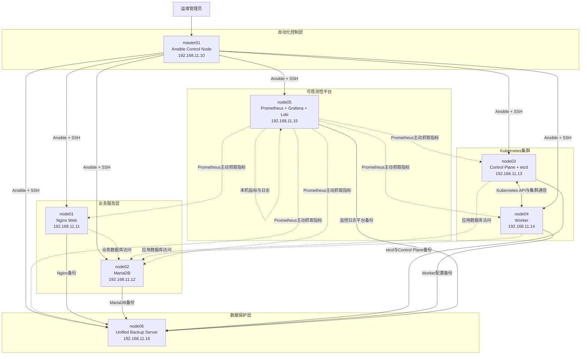

# Enterprise Ansible Platform总体架构

## 架构目标

该平台通过master01统一管理六台Enterprise Linux节点，实现基础环境、Web服务、数据库、Kubernetes、监控日志和备份恢复的集中自动化。

## 节点拓扑

## 架构分层

| 层级 | 组件 | 作用 |
|---|---|---|
| 自动化控制层 | master01、Ansible | Inventory管理、Role编排、批量部署和验证 |
| 业务服务层 | Nginx、MariaDB | 提供Web服务和数据存储 |
| 容器平台层 | Kubernetes、containerd、Calico、etcd | 提供容器编排和集群状态存储 |
| 可观测性层 | Prometheus、Grafana、Loki、Promtail | 指标采集、日志聚合和可视化 |
| 数据保护层 | node06、备份客户端、SHA256 | 统一接收、校验、保留和清理备份 |

## 管理边界

- master01只负责自动化控制，不承载业务服务。
- node03和node04组成Kubernetes集群。
- node05集中承载监控和日志平台。
- node06与业务节点分离，集中保存备份。
- 敏感变量通过Ansible Vault管理。
- 大型安装文件通过Git LFS管理。
